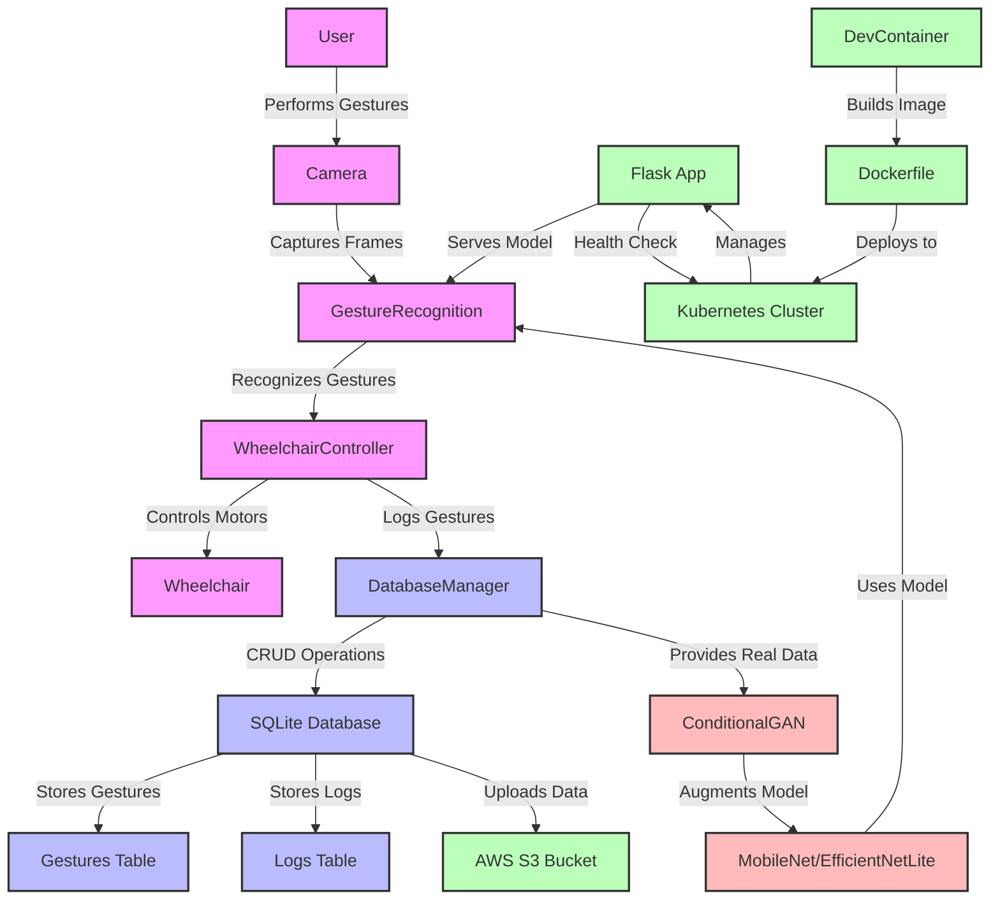

# CV_Wheelchair: Gesture-Controlled Wheelchair with AI and Computer Vision

## Overview
CV_Wheelchair leverages artificial intelligence and computer vision to provide intuitive, hands-free control of a wheelchair. The system uses a real-time gesture recognition model powered by TensorFlow to interpret hand gestures via a camera and control the wheelchair's movement accordingly.
The project aims to enhance accessibility and mobility for individuals with physical disabilities, making it a cutting-edge solution in assistive technology.

## Key Features
- **Gesture Recognition**: Controls wheelchair movement via 4 simple gestures:
  - **Stop**: Fist gesture
  - **Go**: One-finger gesture
  - **Turn Left**: Thumbs left gesture
  - **Turn Right**: Thumbs right gesture
- **Real-Time Inference**: Fast and accurate gesture recognition with low latency using TensorFlow. Optimized for real-time interaction.
- **Easy Setup**: Docker container support for easy deployment, allowing for consistent environments across different machines.
- **Extensible**: Designed for integration with other assistive technologies or customized systems.

## Technologies Used
- **TensorFlow**: Deep learning framework for building and training the gesture recognition model.
- **OpenCV**: Computer vision library for capturing and processing video frames from the camera.
- **Docker**: Containerization for consistent development, testing, and deployment.
- **Python**: Main programming language for model development and system integration.
- **Flask**: Lightweight web framework for managing the API that interfaces with the wheelchair system.

## System Architecture


### Components (simple):
- **Gesture Recognition Model**: A Convolutional Neural Network (CNN) processes camera input and classifies gestures. The model is trained to recognize 4 specific hand gestures.
- **Wheelchair Controller**: Interprets the output of the gesture recognition model and sends movement commands to the wheelchair's motor control system.
- **Web Server (Flask)**: A Flask web server exposes an API for health checks, system control, and status monitoring.

## Installation

### Prerequisites
- Docker Desktop (ensure it is running)
- Python 3.8+ installed
- TensorFlow, OpenCV, Flask, and other dependencies (listed in requirements.txt) [optional - running in docker]

### Steps to Install:
1. **Clone the Repository:**
```bash
git clone https://github.com/darshgarg7/CV_Wheelchair.git
cd CV_Wheelchair/devcontainer
```
2. **Build the Docker Container:**
Ensure Docker is running, then build the container:
```bash
docker build -t cv_wheelchair .
```
3. **Run the Docker Container:**
```bash
docker run -it --rm cv_wheelchair
```
This will start the container with all dependencies pre-installed and ready to run.

## Usage

### Model Training:
1. **Train the Gesture Recognition Model:**
```bash
python3 gesture_model.py
```
2. **Monitor Training with TensorBoard:**
```bash
tensorboard --logdir=./logs
```

### Deploy the Model:
To deploy the model to the system, use the following command:
```bash
python3 -m utils.deployment_utils
```

### Control the Wheelchair:
Start the wheelchair control system by running:
```bash
python3 controller.py
```
This script interprets hand gestures and sends movement commands to the wheelchair.

### Start the Web Server:
Run the Flask web server for system health and control:
```bash
python3 app.py
```
Health Check (optional):
Test if the system is running by checking endpoints (ex: the health endpoint):
```bash
curl http://localhost:8000/health
```

### Unit and Performance Testing:
Run unit tests and performance benchmarks:
```bash
python3 -m unittest discover tests/
```

## Model Architecture

The gesture recognition model is based on **MobileNet and EfficientNetLite**, which are lightweight, pre-trained CNNs optimized for efficiency and performance on resource-constrained devices. These models are fine-tuned for the specific task of gesture classification.

## Fine Tuning

- **Custom Output Layer**:  
  The final classification layer of the pre-trained model is replaced with a new dense layer tailored to the number of gesture classes (e.g., "Stop", "Go", "Turn Left", "Turn Right"). This ensures the model outputs predictions specific to the defined gestures.

- **MobileNet**:  
  Utilizes depthwise separable convolutions, which significantly reduce computational complexity while maintaining high accuracy. This makes it ideal for real-time applications like gesture recognition on resource-constrained devices.

- **EfficientNetLite**:  
  A lightweight variant of EfficientNet, optimized for TensorFlow Lite. It systematically scales model width, depth, and resolution to balance accuracy and performance, making it suitable for edge devices like Raspberry Pi.

## Training Details

- **Training Dataset**:  
  A diverse dataset of hand gesture images labeled with corresponding gestures. To address class imbalances and improve robustness, synthetic data was generated using a **Conditional GAN**. This augmentation step enhanced the model's ability to generalize across different scenarios.

- **Hyperparameters**:  
  Optimized using grid search to find the best trade-off between accuracy and performance. Parameters such as learning rate, batch size, and regularization were fine-tuned to maximize model efficiency.

- **Optimizer**:  
  The **Adam optimizer** was used for faster convergence and better results. Its adaptive learning rate capabilities made it well-suited for training the gesture recognition model.

- **Loss Function**:  
  **Categorical crossentropy** was employed for multi-class classification, ensuring the model effectively learns to distinguish between the different gesture classes.

## Additional Notes

- **Data Augmentation**:  
  Beyond Conditional GAN, traditional augmentation techniques like rotation, scaling, and flipping were applied to further diversify the training dataset.

- **Early Stopping**:  
  Implemented to prevent overfitting by halting training when validation performance plateaus.

- **Model Evaluation**:  
  Precision, recall, and F1-score metrics were used to evaluate the model's performance, ensuring it is both accurate and reliable in real-world scenarios.

- **Deployment Optimization**:  
  The trained model was converted to **TensorFlow Lite** format for efficient deployment on edge devices, ensuring low latency and high throughput during inference.

### Performance Metrics:
- **Accuracy**: Achieved **90%** accuracy on the validation dataset with real-time performance.
- **Inferences per Second**: Real-time inference speed of **30 FPS** (frames per second) during testing.
- **Latency**: Less than **200ms** latency from gesture recognition to wheelchair movement, ensuring minimal delay for users.

## Testing and Validation

- **Unit Tests**: Comprehensive unit tests for model training, gesture recognition, and wheelchair control to ensure the core functionalities are working correctly.
- **Integration Tests**: Simulated real-world user interactions to validate end-to-end system performance.
- **Performance Benchmarks**: Benchmarks include real-time gesture recognition performance, system resource usage, and latency measurements.

## Contributions

I welcome contributions from the community! If you want to contribute, please follow the steps below:

1. Fork the repository and clone your fork.
2. Create a new branch (`git checkout -b feature-branch`).
3. Make your changes.
4. Run tests and ensure everything is working correctly.
5. Commit your changes and push them to your fork.
6. Open a pull request.

Ensure your code adheres to the coding standards and is well-documented.

## License

This project is licensed under the MIT License - see the LICENSE file for details.

## Future Enhancements
- **Model Expansion**: Add more gestures for complex interactions, such as swipe gestures for adjusting wheelchair speed.
- **Real-Time Performance Optimization**: Further optimize the model to run efficiently on edge devices like Raspberry Pi, Jetson Nano, or embedded systems.
- **Web Interface**: Develop a full-featured web interface for configuring gestures, controlling wheelchair settings, and monitoring system health remotely.

## Acknowledgments
- **TensorFlow** and **OpenCV** for providing the frameworks that power the model and video processing.
- **Flask** for enabling the web interface to control and monitor the system.
- Special thanks to open-source contributors for resources on gesture recognition, wheelchair control systems, and assistive technologies.

## Conclusion
The **CV_Wheelchair** project is an innovative solution to assist individuals with physical disabilities. With real-time gesture recognition, low-latency control, and easy setup, the system is designed to improve accessibility and mobility, making it an impactful contribution to assistive technology.

